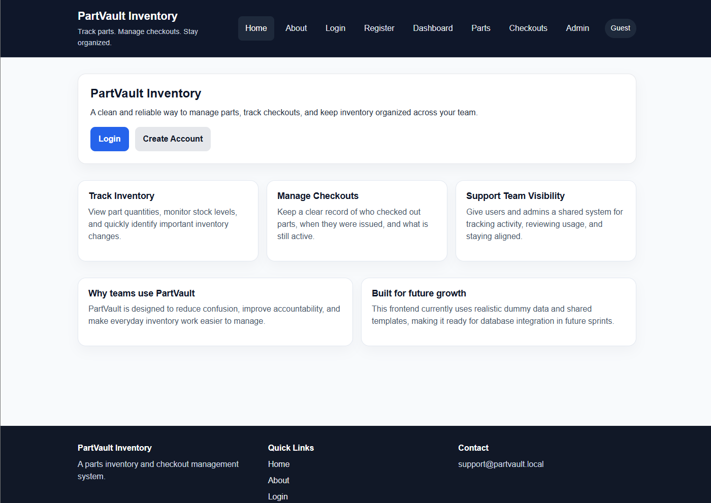
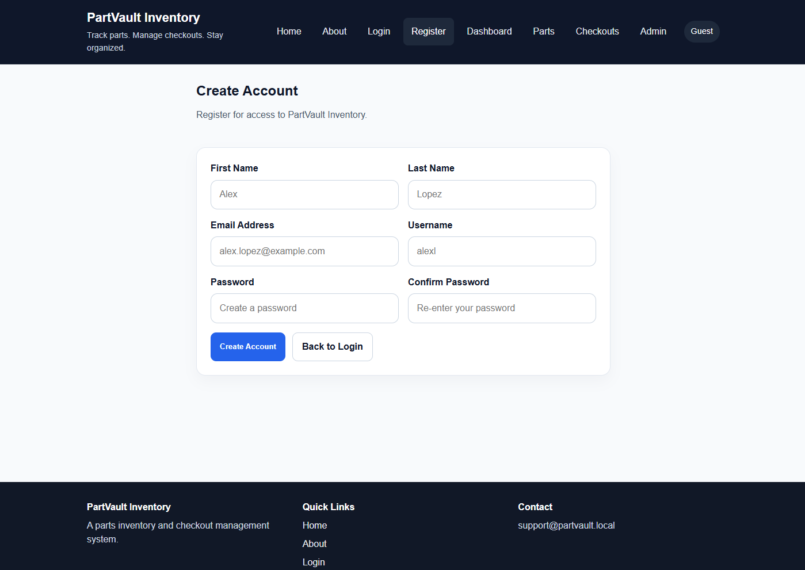
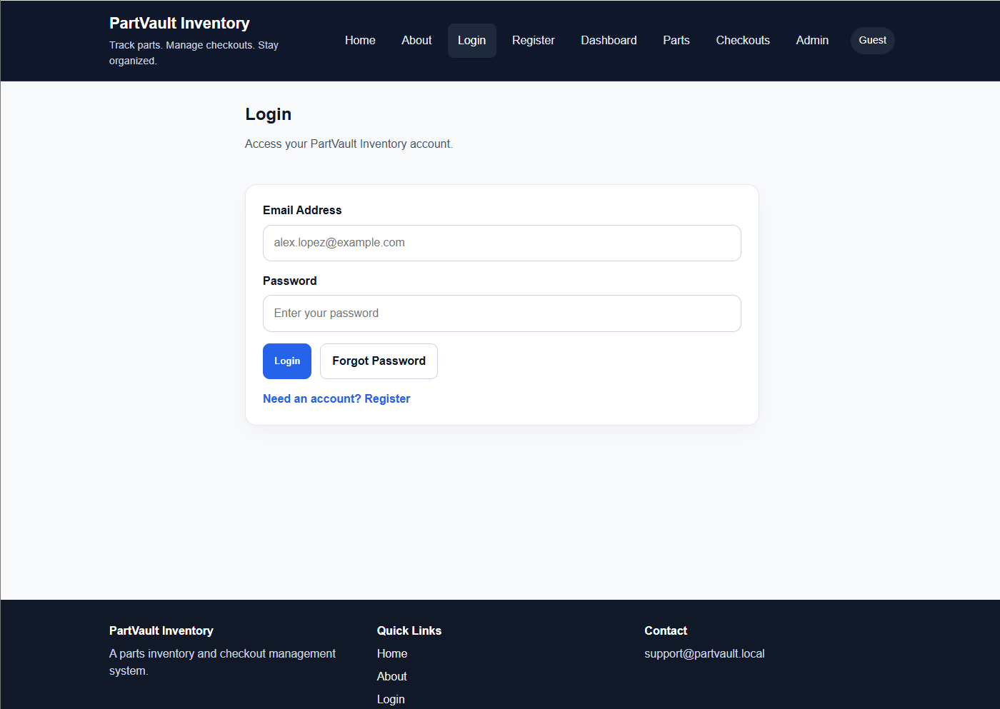
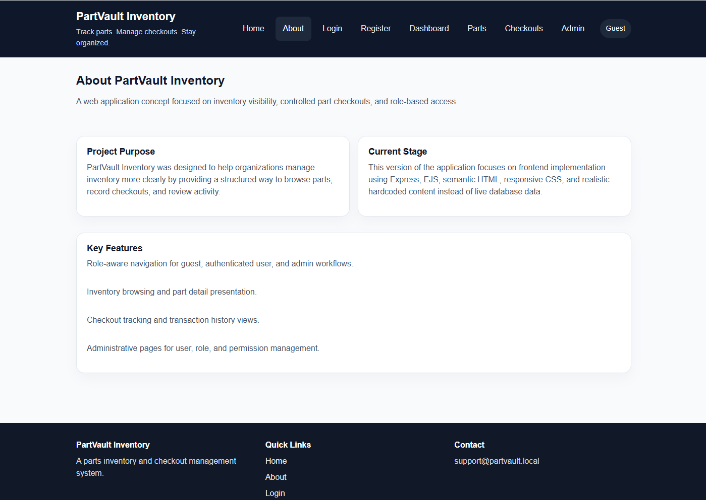
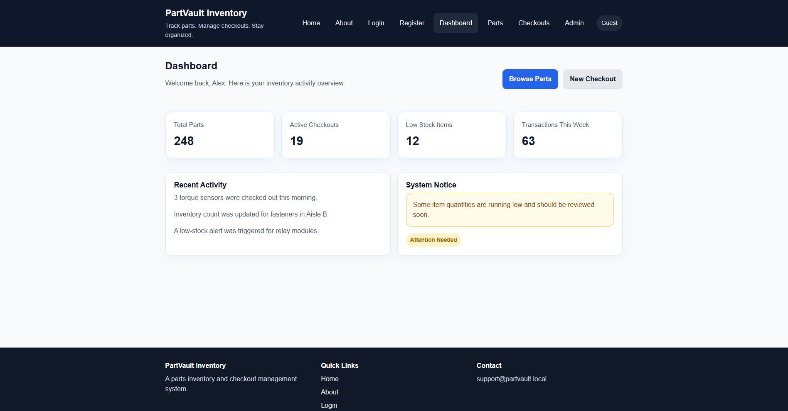
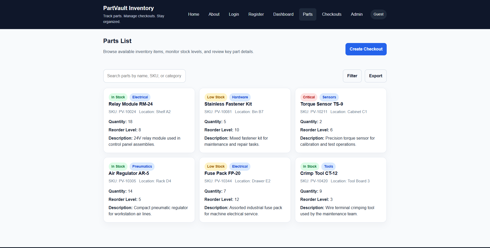
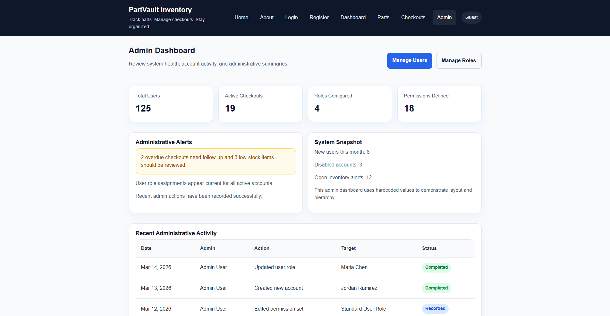

# PartVault Inventory User Guide

## Table of Contents

1. Introduction
2. Getting Started
3. Guest Features
4. User Features
5. Admin Features
6. Account Management
7. Troubleshooting
8. Frequently Asked Questions

## Introduction

PartVault Inventory is a web application designed to help users manage parts inventory and track checkout activity. It gives users a simple way to view available parts, request checkouts, and review transaction history, while giving administrators the tools needed to manage users, roles, and permissions.

This application is intended for environments where parts need to be organized, monitored, and checked in or out in a controlled way. Public visitors can learn about the system and create an account, signed-in users can manage their own checkout activity, and administrators can oversee the system at a higher level.

This guide explains how to use PartVault Inventory from an end-user perspective. It is written in plain language and is organized by user role so you can quickly find the instructions that apply to you.

## Getting Started

This section explains how a new user begins using PartVault Inventory, from opening the application to signing in for the first time.

### Open the Application

1. Open your web browser.
2. Enter the local application address.
3. The Home page will load first.

From the Home page, you can learn about the application, navigate to the About page, or go to the login and registration pages.

### Create an Account

If you do not already have an account, use the registration page.

1. Open the **Register** page.
2. Enter a username.
3. Enter your email address.
4. Enter a password.
5. Submit the registration form.

Your password must meet the application requirements. If the password does not meet the required format, the application will show an error message and ask you to correct it.

### Sign In

After creating an account, you can sign in.

1. Open the **Login** page.
2. Enter your username or email address in the login field.
3. Enter your password.
4. Select the login button.

If the credentials are correct, you will be signed in and allowed to access protected features based on your role.

### Reset Your Password

If you cannot remember your password, use the password reset page.

1. Open the **Reset Password** page.
2. Follow the instructions shown on the screen.
3. Submit the required information.

Note: password reset functionality may be limited depending on the current project version.

### First Steps After Login

After signing in, most users should begin by:

1. Opening the **Dashboard**
2. Reviewing the **Parts List**
3. Opening **Checkouts** to view their own requests or history
4. Updating their **Profile** if needed

Administrators may also open the admin pages to manage users, roles, permissions, and system oversight tasks.

## Guest Features

Guest users are visitors who have not signed in. They can view public pages and create an account, but they cannot access protected inventory or administration features.

### Home Page

The Home page is the main public landing page for PartVault Inventory. It introduces the application and provides navigation to other public areas.

From the Home page, a guest can:

1. Learn the purpose of the application
2. Navigate to the About page
3. Open the Login page
4. Open the Register page

### About Page

The About page gives a general explanation of the project and its purpose.

Guests can use this page to:

1. Understand what PartVault Inventory is used for
2. Learn the general purpose of the system before creating an account
3. Return to the main navigation when ready

### Register Page

The Register page allows a new guest user to create an account.

To register:

1. Open the **Register** page
2. Enter a username
3. Enter an email address
4. Enter a valid password
5. Submit the form

If the registration is successful, the account will be created. If there is a problem, such as a missing field, invalid email, weak password, or duplicate account information, the application will show an error message.

### Login Page

The Login page allows an existing user to sign in.

To sign in:

1. Open the **Login** page
2. Enter your username or email
3. Enter your password
4. Select the login button

If the login is successful, you will gain access to the features allowed by your account role.

### Reset Password Page

The Reset Password page is available to guests who need help accessing their account.

To use it:

1. Open the **Reset Password** page
2. Follow the on-screen instructions
3. Submit the requested information

Depending on the project version, some password reset steps may still be limited or under development.

### Access Restrictions for Guests

Guests cannot access protected pages such as the dashboard, parts list, checkouts, reports, profile, or admin pages. If a guest attempts to open a restricted page without proper access, the application may return an access-related message or an error page.

## User Features

Signed-in users can access the main inventory and checkout features of PartVault Inventory. These features help users review available parts, request part checkouts, view transaction activity, and manage their own account information.

### Dashboard

The Dashboard is the main starting point after login. It provides quick access to the most important parts of the application.

From the Dashboard, a user can:

1. Navigate to the Parts List
2. Open the Checkouts section
3. View transaction-related pages
4. Open their Profile page
5. Access other available signed-in features

### Parts List

The Parts List allows users to view inventory items stored in the system.

From this page, a user can:

1. Browse available parts
2. Review part details
3. Use the information to decide what parts need to be requested

Users can view inventory information, but they do not have permission to directly edit inventory records.

### Checkouts

The Checkouts page allows users to review checkout activity related to their account.

From this page, a user can:

1. View their checkout requests
2. Review the status of previous checkouts
3. Open checkout details when available

This page is intended to help users track their own requests and checkout history.

### Create Checkout

The Create Checkout page allows a user to submit a new checkout request.

To create a checkout request:

1. Open the **Create Checkout** page
2. Enter the requested checkout information
3. Review the entered details
4. Submit the request

After submission, the request can be tracked from the Checkouts page.

### Transactions Log

The Transactions Log allows users to review inventory-related transaction history that is available to them.

Users can use this page to:

1. Review past activity
2. Track inventory movement history that applies to their access level
3. Better understand previous checkout or stock-related actions

### User Access Limits

Signed-in users do not have access to administrator-only features such as user management, role management, or permission assignment. They also do not directly edit inventory records unless that ability has been specifically granted through administrative controls.

## Admin Features

Administrators have the highest level of access in PartVault Inventory. In addition to the standard signed-in user features, administrators can access management tools for users, roles, permissions, and overall system oversight.

### Admin Dashboard

The Admin Dashboard serves as the main starting point for administrative tasks.

From this page, an administrator can:

1. Review high-level system activity
2. Navigate to user and role management pages
3. Access permission-related controls
4. Move to other admin-only sections of the application

### User Management

The User Management page allows administrators to review and manage user accounts.

From this page, an administrator can:

1. View users in the system
2. Open details for a specific user
3. Change a user’s role
4. Deactivate a user when needed

These actions help administrators control access and keep the system organized.

### Role Management

The Role Management page allows administrators to manage the roles used by the application.

From this page, an administrator can:

1. View existing roles
2. Create a new role
3. Edit an existing role
4. Delete a role when it is no longer needed

Role management should be handled carefully because role changes affect what users are allowed to do in the system.

### Permission Assignment

The Permission Assignment page allows administrators to control what each role is allowed to do.

From this page, an administrator can:

1. View available permissions
2. Assign permissions to a role
3. Replace or update a role’s permissions as needed

Changing permissions can affect security and access throughout the application, so administrators should review changes carefully before saving them.

### Admin Responsibilities

Because administrators have broad access, they should use the system carefully and consistently. Administrative actions can affect user access, system security, and how features behave for everyone else using the application.

Administrators should:

1. Review changes before saving them
2. Avoid unnecessary role or permission changes
3. Deactivate accounts only when appropriate
4. Keep access limited to users who need it

## Account Management

This section explains the account-related tasks users may need while using PartVault Inventory.

### Viewing Your Profile

Signed-in users can open the **Profile** page to review their account information.

To view your profile:

1. Sign in to the application.
2. Open the **Profile** page from the navigation.
3. Review the account details shown on the page.

### Updating Profile Information

If editable profile fields are available in the current version of the application, users can update their information from the Profile page.

To update profile information:

1. Open the **Profile** page.
2. Select the field you want to update.
3. Enter the new information.
4. Save the changes.

If profile editing is limited in the current project version, some information may be view-only.

### Changing Your Password

Users should use the available account or reset-password workflow to change or recover access to their password.

To change or recover a password:

1. Open the **Reset Password** page if you cannot access your account.
2. Follow the on-screen instructions.
3. Submit the required information.

If the new password does not meet the required format, the application will display an error message and ask you to correct it.

### Logging Out

To end your session safely:

1. Select the logout option when it is available.
2. Wait for confirmation that you have been signed out.
3. Close the browser if you are using a shared computer.

Logging out helps protect your account, especially on shared or public devices.

### Two-Factor Authentication

Two-factor authentication is not implemented in the current version of PartVault Inventory. If this feature is added in a future version, this guide should be updated with setup and usage steps.

## Troubleshooting

This section helps users solve common problems they may encounter while using PartVault Inventory.

### I cannot log in

If you cannot sign in:

1. Check that you entered the correct username or email address.
2. Check that you entered the correct password.
3. Make sure Caps Lock is not turned on.
4. Try the **Reset Password** page if you think you forgot your password.
5. Try again after confirming your account information.

If the problem continues, the account may be inactive or the login information may be incorrect.

### My registration is not working

If registration fails:

1. Make sure all required fields are filled in.
2. Check that your email address is entered in a valid format.
3. Make sure your password meets the required rules.
4. Try a different username if the current one is already in use.
5. Try a different email address if the current one is already registered.

### My password is rejected

Passwords must meet the application’s minimum requirements.

Check that your password includes:

- at least 8 characters
- at least 1 uppercase letter
- at least 1 lowercase letter
- at least 1 number

If the password does not meet these rules, the application will reject it.

### I cannot access a page after signing in

If you are signed in but still cannot open a page:

1. Make sure your account has permission to use that page.
2. Try returning to the dashboard and opening the page again from navigation.
3. Sign out and sign back in.
4. If you see a **403 Forbidden** page, your account does not have permission for that feature.

### I see a 403 Forbidden page

A **403 Forbidden** page means the application understood your request but your account is not allowed to access that resource.

To resolve it:

1. Return to a page your role is allowed to access.
2. Confirm whether you are signed in with the correct account.
3. Contact the project owner or instructor if you believe your access level is incorrect.

### I see a 404 Not Found page

A **404 Not Found** page means the page or route could not be found.

To resolve it:

1. Check the web address for typing mistakes.
2. Return to the main navigation.
3. Open the page again using the site menu instead of a saved or typed link.
4. If the problem continues, the page may not exist in the current version of the project.

### The page loads but no data appears

If a page opens but does not show expected data:

1. Refresh the page.
2. Sign out and sign back in.
3. Confirm that the application server is running correctly.
4. Confirm that the database connection has been set up properly.
5. Try again after restarting the local project environment if needed.

### My changes do not seem to save

If you submit information and do not see the expected result:

1. Make sure all required fields were completed.
2. Look for an error message on the page or in the API response.
3. Refresh the page and check whether the change was applied.
4. Keep in mind that some features in the current project version may still use placeholder or limited backend behavior.

## Frequently Asked Questions

### 1. What is PartVault Inventory used for?

PartVault Inventory is used to manage parts inventory, track checkout activity, and support controlled access to inventory-related features.

### 2. Do I need an account to use the application?

You can view public pages without signing in, but you need an account to access protected features such as the dashboard, checkouts, profile, and other signed-in pages.

### 3. What should I do if I forget my password?

Open the **Reset Password** page and follow the instructions shown there. Depending on the current project version, some password reset steps may be limited.

### 4. Why can I log in but still cannot access certain pages?

Your account only has access to features allowed by your role. If you try to open a page outside your permission level, you may see a **403 Forbidden** page.

### 5. Can I edit inventory records as a normal user?

No. Standard signed-in users can review parts and manage their own checkout-related activity, but they do not have direct access to inventory management controls.

### 6. What is the difference between a user and an administrator?

A standard user can access normal signed-in features such as viewing parts, creating checkout requests, and viewing personal history. An administrator has broader access, including user management, role management, and permission assignment.

### 7. What should I do if a page does not load correctly?

First refresh the page. If that does not help, return to the navigation menu and reopen the page. If the issue continues, make sure the application server and database are running correctly.

### 8. Is this a production system with formal support?

No. PartVault Inventory is an educational project and does not provide real production support.
